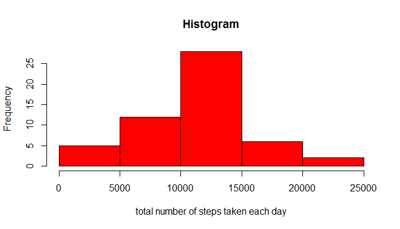

# Peer Assessment 1
Abe1985  
Saturday, October 18, 2014  

This is an R Markdown document. Markdown is a simple formatting syntax for authoring HTML, PDF, and MS Word documents. For more details on using R Markdown see <http://rmarkdown.rstudio.com>.

This document is for the Peer Assessement 1 in Reproducible Reasearch on <https://www.coursera.org/>. 


##Introduction
It is now possible to collect a large amount of data about personal movement using activity monitoring devices such as a Fitbit, Nike Fuelband, or Jawbone Up. These type of devices are part of the "quantified self" movement - a group of enthusiasts who take measurements about themselves regularly to improve their health, to find patterns in their behavior, or because they are tech geeks. But these data remain under-utilized both because the raw data are hard to obtain and there is a lack of statistical methods and software for processing and interpreting the data.

This assignment makes use of data from a personal activity monitoring device. This device collects data at 5 minute intervals through out the day. The data consists of two months of data from an anonymous individual collected during the months of October and November, 2012 and include the number of steps taken in 5 minute intervals each day.

**Data**

The data for this assignment was downloaded from the course web site:
Dataset: [Activity monitoring data [52K]] (https://d396qusza40orc.cloudfront.net/repdata%2Fdata%2Factivity.zip)
The dataset is stored in a comma-separated-value (CSV) file and there are a total of 17,568 observations in this dataset.

The variables included in this dataset are:

1. steps: Number of steps taking in a 5-minute interval (missing values are coded as NA)

2. date: The date on which the measurement was taken in YYYY-MM-DD format

3. interval: Identifier for the 5-minute interval in which measurement was taken


##Loading and preprocessing the data


I downloaded the Zipfile and extraxted the activity.csv file in a folder named "activity" in my working directory.

This is my code that loads the data into R and stores it an an object called activity.:


```r
activity <- read.csv(file="activity/activity.csv", header= TRUE, sep=",", colClasses=c("numeric","Date","numeric"))
summary(activity)
```

```
##      steps            date               interval   
##  Min.   :  0.0   Min.   :2012-10-01   Min.   :   0  
##  1st Qu.:  0.0   1st Qu.:2012-10-16   1st Qu.: 589  
##  Median :  0.0   Median :2012-10-31   Median :1178  
##  Mean   : 37.4   Mean   :2012-10-31   Mean   :1178  
##  3rd Qu.: 12.0   3rd Qu.:2012-11-15   3rd Qu.:1766  
##  Max.   :806.0   Max.   :2012-11-30   Max.   :2355  
##  NA's   :2304
```


##Process/transform the data into a format suitable for your analysis

The following code creates a clean data set without missing values that will be stored in an object called "cleanActivity":

```r
cleanActivity <- activity[complete.cases(activity),]
summary(cleanActivity)
```

```
##      steps            date               interval   
##  Min.   :  0.0   Min.   :2012-10-02   Min.   :   0  
##  1st Qu.:  0.0   1st Qu.:2012-10-16   1st Qu.: 589  
##  Median :  0.0   Median :2012-10-29   Median :1178  
##  Mean   : 37.4   Mean   :2012-10-30   Mean   :1178  
##  3rd Qu.: 12.0   3rd Qu.:2012-11-16   3rd Qu.:1766  
##  Max.   :806.0   Max.   :2012-11-29   Max.   :2355
```

**What is mean total number of steps taken per day?**


```r
sapply(split(cleanActivity$steps, cleanActivity$date),mean)
```

```
## 2012-10-02 2012-10-03 2012-10-04 2012-10-05 2012-10-06 2012-10-07 
##     0.4375    39.4167    42.0694    46.1597    53.5417    38.2465 
## 2012-10-09 2012-10-10 2012-10-11 2012-10-12 2012-10-13 2012-10-14 
##    44.4826    34.3750    35.7778    60.3542    43.1458    52.4236 
## 2012-10-15 2012-10-16 2012-10-17 2012-10-18 2012-10-19 2012-10-20 
##    35.2049    52.3750    46.7083    34.9167    41.0729    36.0938 
## 2012-10-21 2012-10-22 2012-10-23 2012-10-24 2012-10-25 2012-10-26 
##    30.6285    46.7361    30.9653    29.0104     8.6528    23.5347 
## 2012-10-27 2012-10-28 2012-10-29 2012-10-30 2012-10-31 2012-11-02 
##    35.1354    39.7847    17.4236    34.0938    53.5208    36.8056 
## 2012-11-03 2012-11-05 2012-11-06 2012-11-07 2012-11-08 2012-11-11 
##    36.7049    36.2465    28.9375    44.7326    11.1771    43.7778 
## 2012-11-12 2012-11-13 2012-11-15 2012-11-16 2012-11-17 2012-11-18 
##    37.3785    25.4722     0.1424    18.8924    49.7882    52.4653 
## 2012-11-19 2012-11-20 2012-11-21 2012-11-22 2012-11-23 2012-11-24 
##    30.6979    15.5278    44.3993    70.9271    73.5903    50.2708 
## 2012-11-25 2012-11-26 2012-11-27 2012-11-28 2012-11-29 
##    41.0903    38.7569    47.3819    35.3576    24.4688
```


**Make a histogram of the total number of steps taken each day**

This is an overview of the total number of steps taken per day:

```r
barplot(sapply(split(cleanActivity$steps, cleanActivity$date),sum), col= "red", main = "total number of steps taken each day", xlab= "")
```

 
 
This Histogramm shows the frequency of the total number of steps taken per day:


```r
h <- sapply(split(cleanActivity$steps, cleanActivity$date),sum)
hist(h, col= "red", main = "Histogram", xlab= "total number of steps taken each day")
```

 

**calculate and report the mean and median total number of steps taken per day**

The following R-Code callculates the mean and median

```r
a <- mean(sapply(split(cleanActivity$steps, cleanActivity$date),sum))
b <- median(sapply(split(cleanActivity$steps, cleanActivity$date),sum))
```
The mean number of steps taken per day is 1.0766 &times; 10<sup>4</sup>
The median number of steps taken per day is 1.0765 &times; 10<sup>4</sup>


##What is the average daily activity pattern?

**Make a time series plot of the 5-minute interval (x-axis) and the average number of steps taken, averaged across all days (y-axis)**

```r
ts <- sapply(split(cleanActivity$steps, cleanActivity$interval),mean)
plot(ts, type = "l", main = "Average steps taken per interval", xlab= "interval number", ylab="average number of steps taken, averaged across all days", labels=FALSE,tick=FALSE)
axis(1, at=c(1,45,89,133,177,221,265), labels=c(0,340,720,1100,1440,1820,2200))
axis(2, labels=TRUE)
```

 


**Which 5-minute interval, on average across all the days in the dataset, contains the maximum number of steps?**

```r
intervals <- sapply(split(cleanActivity$steps, cleanActivity$interval),sum)
mnos <- max(intervals)
m <- intervals[intervals == mnos]
m
```

```
##   835 
## 10927
```
The 835 inteval has the maximum number of steps, namely 1.0927 &times; 10<sup>4</sup>


##Imputing missing values

Note that there are a number of days/intervals where there are missing values (coded as NA). The presence of missing days may introduce bias into some calculations or summaries of the data.


**Calculate and report the total number of missing values in the dataset (i.e. the total number of rows with NAs)**


Devise a strategy for filling in all of the missing values in the dataset. The strategy does not need to be sophisticated. For example, you could use the mean/median for that day, or the mean for that 5-minute interval, etc.


```r
nanum <- sum(is.na(activity))
nad <- sum(is.na(activity$date))
nast <- sum(is.na(activity$steps))
naint <- sum(is.na(activity$interval))
```
The number of Na's in the dataset is 2304. There 0 are missing values in the date column, 2304 missing values in the steps column and 0 missing values in the interval column. Therefore I only need to fill the missing steps values.    

I will try to fill them with the mean for each 5-minute interval. The following object contains a list of the means for each intervall:

```r
meanstoimpute <- sapply(split(cleanActivity$steps, cleanActivity$interval),mean)
```


**Create a new dataset that is equal to the original dataset but with the missing data filled in.**
In the following R-code chunck i created a copy of the activity matix names activityimp. The for loop looks at every entry in the steps column of the activityimp matrix. If there is an NA value it replaces the vale with the mean stored to the corresponding value in the labels column. It will pull it out of the list of the means for each intervall created above. The summary fuction shows there are no NAs left after the imputation.


```r
activityimp <- activity
for(i in 1:length(activityimp$steps)){
        x <- as.character(activityimp$interval[i])
        if(is.na(activityimp$steps[i])){
                
                activityimp$steps[i] <- meanstoimpute[x]}
       }
summary(activityimp)
```

```
##      steps            date               interval   
##  Min.   :  0.0   Min.   :2012-10-01   Min.   :   0  
##  1st Qu.:  0.0   1st Qu.:2012-10-16   1st Qu.: 589  
##  Median :  0.0   Median :2012-10-31   Median :1178  
##  Mean   : 37.4   Mean   :2012-10-31   Mean   :1178  
##  3rd Qu.: 27.0   3rd Qu.:2012-11-15   3rd Qu.:1766  
##  Max.   :806.0   Max.   :2012-11-30   Max.   :2355
```

**Make a histogram of the total number of steps taken each day and Calculate and report the mean and median total number of steps taken per day.**

```r
h <- sapply(split(activityimp$steps, activityimp$date),sum)
hist(h, col= "red", main = "Histogram", xlab= "total number of steps taken each day")
```

 


```r
c <- mean(sapply(split(activityimp$steps, activityimp$date),sum))
d <- median(sapply(split(activityimp$steps, activityimp$date),sum))
```
The mean number of steps taken per day is now 1.0766 &times; 10<sup>4</sup>
The median number of steps taken per day is now 1.0766 &times; 10<sup>4</sup>

**Do these values differ from the estimates from the first part of the assignment?**  
Yes, there are some minor changes in the output. The mean stays the same. Which is logical, since I used the mean to impute the values. Only the median is slightly changed to the same value as the mean.  
**What is the impact of imputing missing data on the estimates of the total daily number of steps?**    
In the following we see the total daily number of steps before and after the imputation:   
 
  
  As you can see as an impact we have two additional days displayed in the graph. Before the data was missing on the 2012-10-02 and 2012-11-13 know we have them replaced. 
